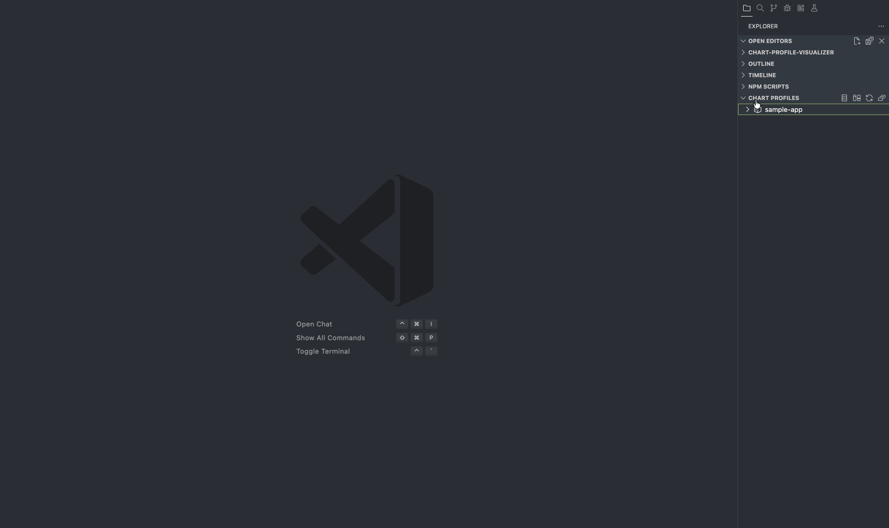

# Chart Profile Visualizer

Visualize and compare Helm chart configurations across environments (dev/stage/prod) to detect risky drift before deployment.

> Best for platform engineers, SREs, and teams managing multi-environment Kubernetes releases.

## Why this extension

Chart Profile Visualizer helps you:

- **Detect config drift early** across environments
- **Reduce deployment risk** by highlighting high-impact differences
- **Speed up reviews** with visual and structured comparisons
- **Improve release confidence** before promotion to production

## Quick Start (2 minutes)

✅ Expected outcome: You see a structured comparison of chart values and identified drift.

## Example workflow

Use sample files in `examples/`:

- `examples/values-dev.yaml`
- `examples/values-qa.yaml`
- `examples/values-staging.yaml`
- `examples/values-prod.yaml`

## Core features

- Environment profile comparison
- Visual diff for Helm values
- Drift categorization (config groups)
- Fast local analysis in VS Code

## Recommended next features (roadmap)

- Severity scoring: `Info / Warning / Critical`
- Risk-focused presets (security/network/resources)
- Export comparison report (Markdown/JSON)
- PR comment integration for release checks

## Compatibility

- VS Code: `<min-version>`
- Helm values format: YAML
- OS: macOS / Linux / Windows

## Data handling & privacy

- Processing is performed locally in VS Code.
- No chart values are transmitted externally unless explicitly configured by user.
- Telemetry (if enabled) is anonymized and excludes secrets/chart payloads.

## Troubleshooting

### “VS Code API has already been acquired” error
- Ensure webview API is acquired only once per webview lifecycle.
- Reload window and retry command.
- Update to latest extension version.

### No comparison output
- Confirm selected files are valid YAML.
- Verify file paths and environment mapping.
- Check output panel logs.

## Contributing

See [CONTRIBUTING.md](CONTRIBUTING.md).

## Architecture

See [ARCHITECTURE.md](ARCHITECTURE.md).

## License

MIT

## Support

For issues and feature requests, use [GitHub Issues](https://github.com/chaluvadis/chart-profile-visualizer/issues).
